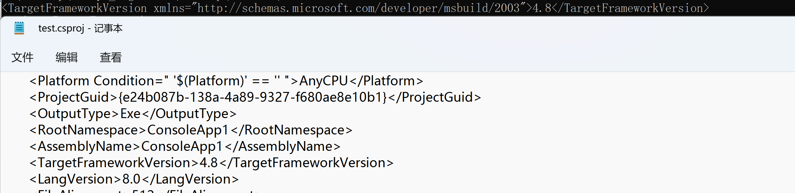
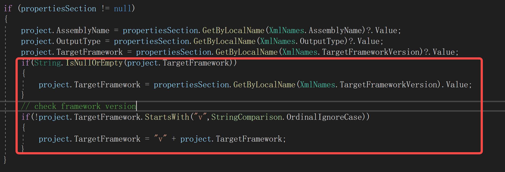

# DotNetProjectParser 
Simple, version-independent XML-based parser of csproj files

## Why another CSPROJ parser?
I needed a simple tool that will extract basic project info from any csproj file, regardless of target framework (Core, Standard, Framework) and version of Visual Studio that spawned them.

## Why not MSBuild?
Using MSBuild related assemblies turned out to be troublesome due to incompatibilities between versions of msbuild <> csproj.

I could not find any version of msbuild .dll that would handle very old .Net Framework csproj files, new .Net Framework csproj files and .Net Core packages.  

Got tired of random 'project parsing errors', decided to quickly put together own XML based solution.

## NuGet
https://www.nuget.org/packages/DotNetProjectParser/  
```
PM > Install-Package DotNetProjectParser -Version 1.0.0
```

## Free resources attribution
Icon by https://www.flaticon.com/authors/flat-icons from https://www.flaticon.com/


# bug

> DotNetParse 解析 framework版本信息时
>
> 如果 <TargetFrameworkVersion> 不是以 v4.8开头将会导致解析错误




> System.Xml.Linq.Xelement
>
> 解析framework的  csproj  
>
> <TargetFrameworkVersion> 全称是
>
> <TargetFrameworkVersion xmlns="http://schemas.microsoft.com/developer/msbuild/2003">4.8</TargetFrameworkVersion>
>
> 对于.NET项目  版本element是   TargetFramework


> 经过测试  VS csproj文件   TargetFrameworkVersion   没有“v4.8" 是可以编译成功的，
>
> 因此这里对DotNetProjectParser做个修复
>
> NetFrameworkProjectReader.cs



